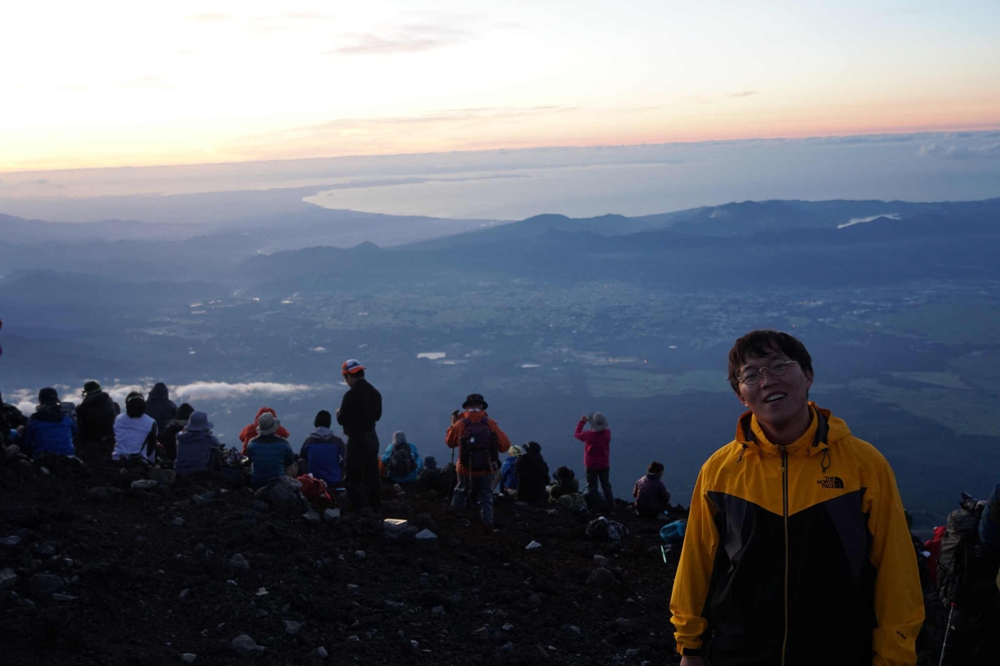

   
<figure>
	
	<figcaption>Grinning after climbing Mt. Fuji, in 18 Aug 2018.</figcaption>
</figure>

Dogyun Hwangbo is a South Korea-born young researcher, amatuer football player who has been living in Japan since 2008. He is majored in Engineering and especially insterested in plasma physics and controlled fusion; plasma-surface interactions; atmospheric plasma sources and its applications. He is currently working for the University of Tsukuba as an assistant professor. He loves to play football and enjoys watching the domestic professional league of League of Legend - a.k.a. LoL - where I specially support Lee "Faker" Sang-Hyeok.

********* 
Affiliation 
Faculty of Pure and Applied Sciences, University of Tsukuba 
Plasma research center, University of Tsukuba 
Tel:+81-29-853-7474, (sub)+81-29-853-4325 

## Please find the links for my accomplishments below:

<a href="https://www.dropbox.com/s/2jez1kguilo3zvd/cv_dogyun.pdf?dl=0" class="btn" target="_blank">CV</a><a href="https://scholar.google.co.jp/citations?user=7m9WB2wAAAAJ&hl=en&oi=ao" class="btn" target="_blank">Google scholar</a>

